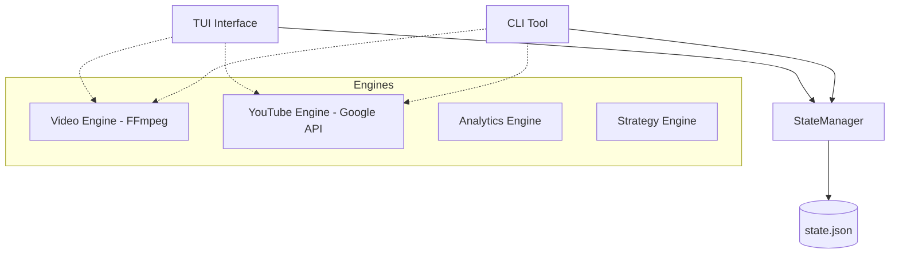

# BeatManager Architecture

BeatManager is a "Type Beat" channel management system designed for high-performance video rendering, YouTube automation, and SEO-driven niche analysis.

## 1. High-Level Overview

The system is built on a **Modular Engine** architecture with multiple entry points (TUI and CLI) sharing a common **State Layer**.

## 2. Core Components

### 2.1 State Layer (`state_manager.py`)
- **Technology:** TinyDB (`state.json`).
- **Role:** Centralized repository for:
    - **Tasks:** Queue of render/upload/analyze jobs.
    - **Settings:** API keys, channel configurations.
    - **Folders:** Managed directories for audio assets.
- **Limitation:** Currently acts as a passive log rather than a true message queue.

### 2.2 Execution Engines
- **Video Engine (`video_engine.py`):** Wraps FFmpeg. Handles image-to-video looping, audio merging, and text overlays.
- **YouTube Engine (`youtube_engine.py`):** Wraps Google API Python Client. Handles OAuth2, chunked uploads, and metadata updates.
- **Analytics Engine (`analytics_engine.py`):** Performs keyword research and trend analysis using a hybrid of simulated web search and targeted YouTube API calls.
- **Strategy Engine (`strategy_engine.py`):** Generates Markdown reports based on niche maps and SEO data.
- **Audio Engine (`audio_engine.py`):** Scans directories for audio metadata (BPM, duration, sample rate).

### 2.3 User Interfaces
- **TUI (`tui.py`):** Built with `Textual`. Provides a dashboard, production form, and library browser.
- **CLI (`cli.py`):** Built with `argparse`. Provides command-line access to all engine functions.

## 3. Current Execution Model (Synchronous/In-Process)
1. **Request:** User triggers an action (e.g., "Render").
2. **State:** UI adds a "Pending" record to `state.json`.
3. **Action:** UI immediately calls the relevant Engine class in a sub-thread or main thread.
4. **Completion:** UI updates the task status in `state.json` to "Finished".

## 4. Proposed "Autonomous" Model (Decoupled)
To support background execution and agent-based interaction:
1. **Task Injection:** TUI/CLI/Agents *only* write to `state.json`.
2. **Background Worker:** A dedicated `worker.py` process polls the state and executes tasks sequentially or in parallel.
3. **Status Polling:** TUI/CLI monitor the state for updates.
4. **Resilience:** If the TUI closes, the worker continues to run.
