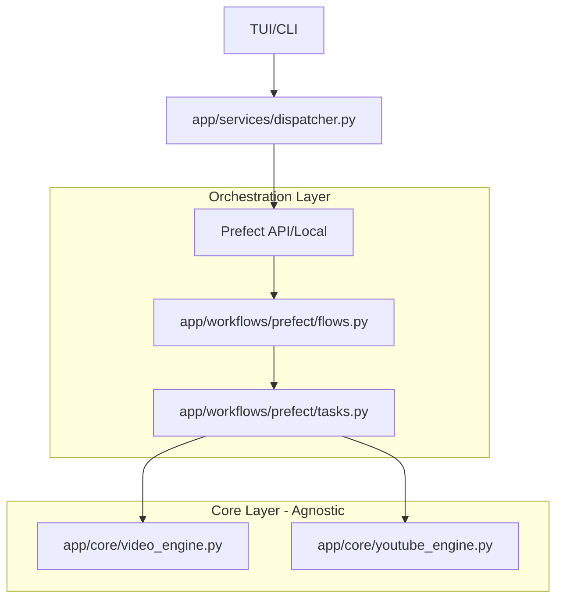

# BeatManager: Prefect Migration & Orchestration Plan

This document provides a technical roadmap for migrating BeatManager from a manual polling-loop (`worker.py`) to **Prefect**, while maintaining strict architectural isolation of the core engines.

---

## 🏗️ The "Isolated Orchestrator" Architecture

To ensure you can switch orchestrators (e.g., to Airflow or Dagster) in the future, we maintain three distinct layers:

1.  **Core Layer (`app/core/`):** Pure Python logic. No knowledge of Prefect. Uses standard `logging` and Pydantic models.
2.  **Workflow Layer (`app/workflows/prefect/`):** The "Adapter" layer. Contains Prefect `@task` and `@flow` decorators. It imports the Core engines and executes them.
3.  **Interface Layer (CLI/TUI):** Triggers the Workflows via a unified `Dispatcher`.



---

## 🌳 Git Branching Strategy (Work Safely)
To avoid breaking your functional `main` branch while experimenting with Prefect, follow this workflow:

### 1. Create a Feature Branch
Before writing any Prefect code, create and switch to a dedicated branch:
```bash
git checkout -b feature/prefect-migration
```

### 2. Work & Commit Frequently
Make small, atomic commits as you complete sub-tasks.
```bash
git add .
git commit -m "feat: implement Prefect task wrapper for VideoEngine"
```

### 3. Merging Back to Main
Only merge when the migration is 100% stable and tested:
```bash
# Switch back to the main branch
git checkout main

# Merge the changes from your feature branch
git merge feature/prefect-migration

# Delete the feature branch after a successful merge
git branch -d feature/prefect-migration
```

### 4. Safety Rules
*   **Commit before switching:** Never switch branches with uncommitted changes.
*   **Resolve Conflicts Early:** If Git reports a conflict during merge, open the affected files, choose the correct code (between `<<<<<<<` and `>>>>>>>`), save, and commit.
*   **Keep Main Clean:** Use `main` only for code that is currently working and verified.

---

## 📅 Phase 1: Foundation & Boundary Setup
*Goal: Prepare the environment and define the communication contract.*

- [ ] **Dependency Management:** Add `prefect` and `prefect-pydantic` to `requirements.txt`.
- [ ] **Standardized Logging:** Update `app/core/` engines to use a standard logger named `beatmanager.core`. 
    -   *Tip:* This allows Prefect to "hijack" the logs later using `log_prints=True` or a logging bridge without editing the core files.
- [ ] **Local Prefect Setup:** 
    -   Run `prefect server start` to initialize the local DB and UI.
    -   Create a **Work Pool** named `local-process`.

---

## 🧪 Phase 2: The Adapter Layer (Prefect Tasks)
*Goal: Create the wrappers in `app/workflows/prefect/`.*

- [ ] **Implement `tasks.py`:**
    ```python
    # Example: app/workflows/prefect/tasks.py
    from prefect import task, get_run_logger
    from app.core.video_engine import VideoEngine
    
    @task(name="Render Video", retries=2)
    def render_video_task(config):
        # We instantiate the engine INSIDE the task
        engine = VideoEngine()
        return engine.create_video(config)
    ```
- [ ] **Implement `flows.py`:**
    -   Create a `production_pipeline` flow that chains `render_video_task` -> `upload_video_task`.
    -   Use Prefect's `wait_for` to handle dependencies between tasks.

---

## 🔌 Phase 3: Integration (Updating the Dispatcher)
*Goal: Connect the TUI/CLI to the new engine.*

- [ ] **Refactor `TaskDispatcher`:**
    -   Currently, `dispatcher.py` calls engines directly. 
    -   Update it to use the `PrefectClient` to trigger flow runs.
    -   *Logic:* Instead of `self.video_engine.create_video()`, it now calls `prefect_client.deployments.run_deployment("production-pipeline/default")`.
- [ ] **Maintenance of `state.json`:**
    -   **Stop** using `state.json` for task status (Pending/Finished).
    -   **Continue** using `state.json` for domain data: `audio_assets` and `folders`.

---

## 🚀 Phase 4: The Deployment Strategy
*Goal: Move away from `worker.py`.*

- [ ] **Create `prefect.yaml`:** Define your deployments (Schedules, Parameters, Work Pools).
- [ ] **Replace Worker:** 
    -   Instead of `python worker.py`, you will now run:
      `prefect worker start --pool local-process`.
- [ ] **Auto-Scheduling:** Migrate the `StrategyManager` logic into a Prefect **Cron Schedule** so the weekly queue is compiled and executed automatically.

---

## 🛠️ Next Steps (Action Items)
1.  Initialize the `feature/prefect-migration` branch.
2.  Install `prefect` in your venv.
3.  Create the `app/workflows/prefect/` directory.
4.  Try wrapping the `VideoEngine` first—it's the most isolated component.
